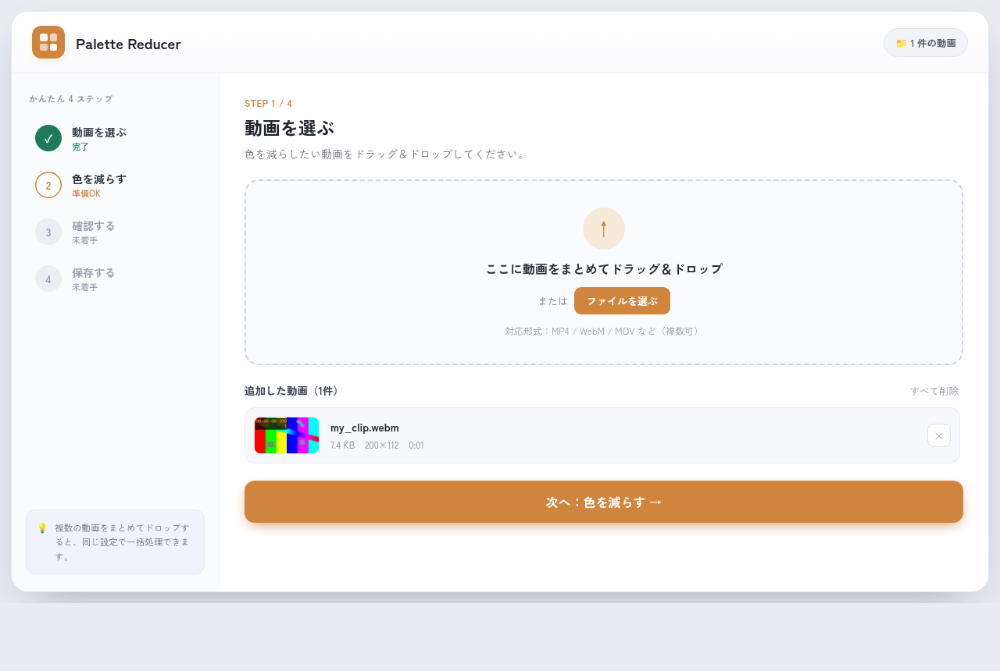
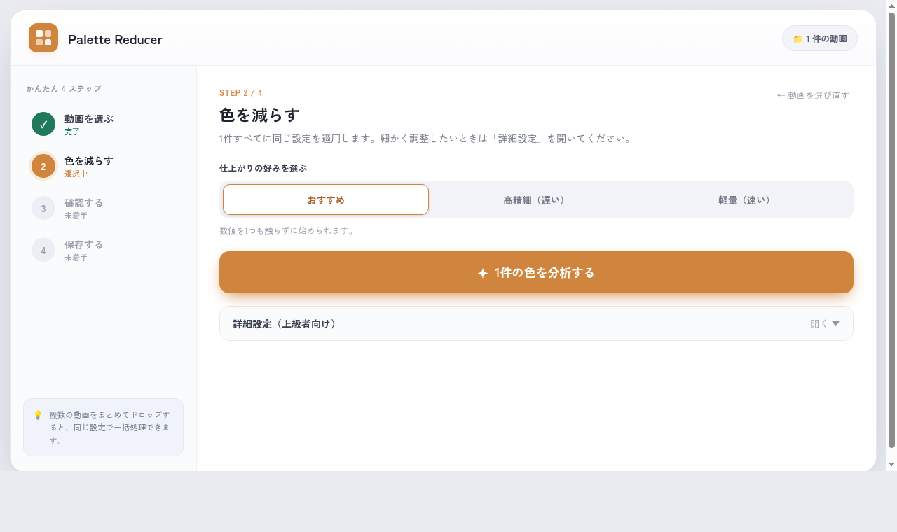
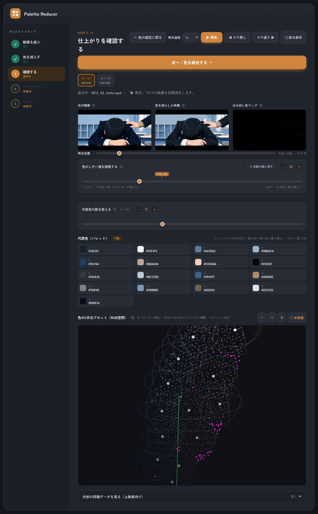
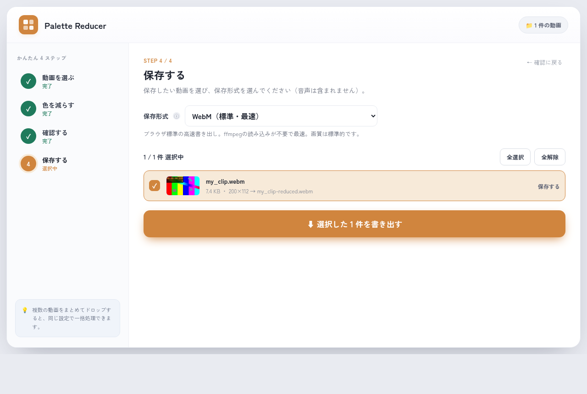

# 🎨 Palette Reducer — 動画の色を減らすアプリ

動画の色を少数の代表色に置き換える（色数を減らす）ためのアプリです。

## 👉 アプリを開く

### **https://1g-hub.github.io/palette-reducer-app/**

ブラウザでこのリンクを開くだけで、すぐに使えます（インストール不要）。

> 🔒 すべてパソコンのブラウザの中だけで処理されます。
>
> 📌 **Google Chrome / Microsoft Edge** での利用をおすすめします。

---

## 使い方（かんたん4ステップ）

画面左の「かんたん 4 ステップ」を上から順に進めるだけです。

### STEP 1 — 動画を選ぶ

1. 点線のエリアに**動画をドラッグ＆ドロップ**するか、「ファイルを選ぶ」を押して選びます。
2. 複数の動画をまとめて入れてもOK（同じ設定で一括処理できます）。
3. 追加した動画のサムネイル（小さなプレビュー）が表示されます。間違えたら「×」で削除できます。
4. 「**次へ：色を減らす →**」を押します。

> 対応形式の目安：MP4 / WebM / MOV など。ブラウザが直接読めない動画は、自動でブラウザ内変換してから処理します（初回のみ変換用データの読み込みに少し時間がかかります）。

### STEP 2 — 色を減らす（設定して分析）

1. 「仕上がりの好み」を選びます。基本は **「おすすめ」** のままでOKです。
   - **おすすめ**：バランス重視（迷ったらこれ）
   - **高精細（遅い）**：きれいだけど時間がかかる
   - **軽量（速い）**：速いけど粗め
2. 「**色を分析する**」を押すと分析が始まります。
3. 細かく調整したい人は「詳細設定」を開くと、解像度や色数などを変えられます。
   - 標準では書き出し短辺を 360px に抑えて高速化します。高画質で保存したい場合は短辺を 720px に上げるか、「入力と同じ解像度で書き出す」をオンにしてください。

### STEP 3 — 仕上がりを確認する

3つの映像で仕上がりを確認できます。

- **元の動画**：読み込んだそのままの映像
- **色を減らした映像**：代表色だけで作り直した映像
- **はみ出し色マップ**：🟣 **マゼンタ = 代表色のどれにも当てはまらない色** がどこにあるかを示します

調整できること：

- **「▶ 再生」**  3つの映像を同時に再生して確認。**「🔁 連続再生」** で繰り返し再生。
- **再生速度**  0.25x から 4x まで切り替えてプレビューできます。
- **拡大表示**  GitHub Pages上でも動く別ブラウザウィンドウで、3つのプレビューを大きく確認できます。横3 / 上2下1 / 縦3 の配置切替、拡大縮小、倍率入力、再生位置としきい値の調整に対応しています。別モニターで確認したい場合もこの表示を使います。
- **色のしきい値を調整する**  スライダーまたは「− ＋」ボタンで調整。小さくするとマゼンタ（はみ出し色）が増え、大きくすると減ります。スライダー上の **「マゼンタ0」マーカー**は、表示中のフレームでマゼンタが出なくなる位置の目安です。
- **代表色の数を変える**  「− ＋」で代表色を1つずつ増減できます。
- **代表色（パレット）**  選ばれた色の一覧。色をクリックすると **HEX（色コード）をコピー**できます。
- **色の3次元プロット（RGB空間）**  動画の色を立体的に表示。ドラッグで回転、ホイールで拡大、右ドラッグ（またはShift＋ドラッグ）で移動、「⛶ 全画面」も可能。大きな点が代表色、その周りの球が「しきい値の範囲」で、球から外れた色はマゼンタで表示されます。
- **↺ 自動の値に戻す**  いじったしきい値・代表色数を、分析時の自動値に戻します。

問題なければ「**次へ：保存する →**」。

### STEP 4 — 保存する（書き出し）

1. 保存したい動画にチェックを入れます。
2. **保存形式**を選びます（ⓘ や説明文で各形式の特徴が分かります）。迷ったら **「WebM（標準・速い）」** が手軽です。
3. **書き出しモード**を選びます。
   - **完全書き出し**：低速ですが、WebCodecsで各フレームに明示的な時刻を付けて書き出します。フレームの停止・飛びを避けたい場合はこちらを使います。
   - **高速**：標準WebMを再生しながら各フレームを取り込み、WebCodecsで実時間に近い速度で書き出します。壁時計フリーズは起きません（極端に重い場面でごく一部のフレームが間引かれることがあります）。
4. 「**⬇ 選択した○件を書き出す**」を押します。
   - 「**保存先フォルダを選ぶ**」がオン（Chrome / Edge）なら保存先フォルダを選べます。オフ、または選べなかったときは各行の「ダウンロード」リンク（ブラウザのダウンロードフォルダ）に保存されます。
   - ⚠️ **Downloads・デスクトップ・ドキュメントなどの「直下」はブラウザの仕様で選べません**（「システムファイルが含まれるため開けない」と出ます）。その場合は **中に新しいフォルダを作って選ぶ** か、**チェックを外してダウンロード保存** してください。
5. 書き出し後も、**形式や対象を変えて「もう一度書き出す」**ことができます。最初からやり直すときは「最初に戻る」。

> ⚠️ 書き出される動画に**音声は含まれません**（映像のみ）。

---

## 保存形式の選び方（早見表）

| 形式 | 特徴 | こんなときに |
|---|---|---|
| **WebM（標準・速い）** | どちらもWebCodecs（完全＝1フレームずつ正確／高速＝再生しながら取り込み） | まず手軽に保存したい |
| **非圧縮 RGB（AVI）** | 色をそのまま完全保持・最高品質 | 画質を一切落としたくない（容量大） |
| **FFV1 可逆圧縮・RGB** | 完全画質のまま圧縮で小さめ | 保存・編集用に高品質で残したい |
| **H.264 / H.265 ロスレス** | 劣化なし | 互換性のある可逆保存 |
| **ProRes 4444** | 編集向け高品質 | 動画編集ソフトで使う |
| **H.264 MP4（標準）** | 高画質で広く再生できる | 一般的な共有・再生 |
| **MP4 / WebM 低ビットレート** | 容量が小さい | アップロード・共有用 |

> 色をプレビューと**完全に一致**させたいときは **「非圧縮 RGB」か「FFV1」** がおすすめです（RGBのまま保存するため）。
>
> H.264 / WebM などはYUV方式に変換するため、ごくわずかに色が変わることがあります。
>
> ※ 高品質な形式ほど書き出しに時間がかかります。一部の形式（H.265など）はお使いの環境で利用できない場合があります。
