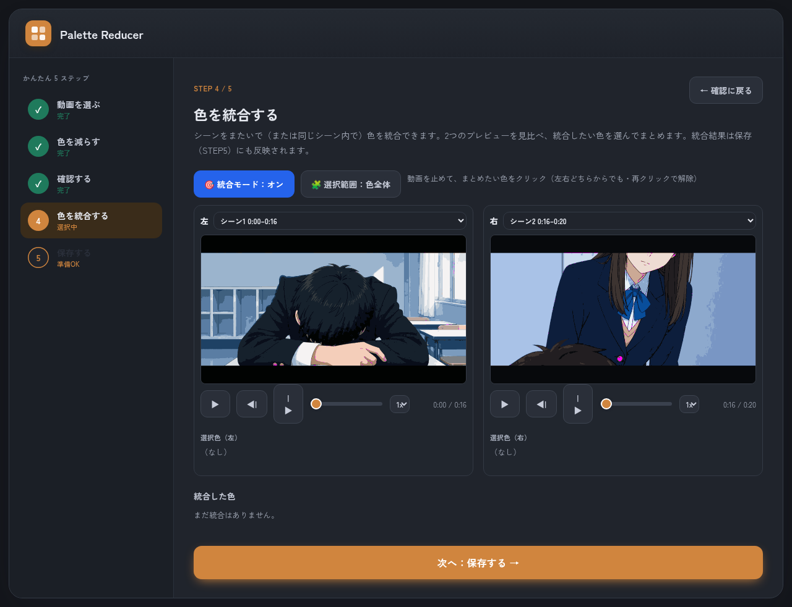
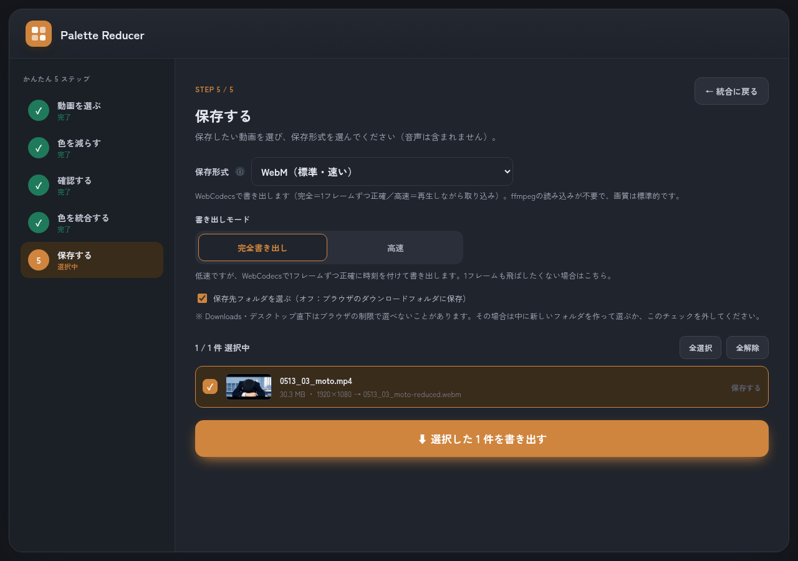

# 🎨 Palette Reducer — 動画の色を減らすアプリ

動画の色を少数の代表色に置き換える（色数を減らす）ためのアプリです. アニメ風・イラスト風の平坦な塗りや, レトロ／ポスター調の表現に向いています. 

## 👉 アプリを開く

### **https://1g-hub.github.io/palette-reducer-app/**

ブラウザでこのリンクを開くだけで, すぐに使えます（インストール不要）. 

> 🔒 **すべてパソコンのブラウザの中だけで処理されます. ** 動画が外部に送られることはありません. 
>
> 📌 **Google Chrome / Microsoft Edge** での利用をおすすめします. 

---

## ✨ できること

- **色を減らす** … 動画全体を代表色（パレット）だけで作り直します. 
- **🎬 シーンごとに色を分ける**（全編通し／シーン別）… カット（場面）ごとに別々のパレットを作り, 各シーンに最適な色で減色できます. 
- **🎚 いらない色をOFFにする** … パレットの色をクリックすると, その色を使わず**一番近い別の色に振り替え**られます. 
- **🧩 色を統合する** … 似た色や, シーンをまたいでバラついた色を**1つにまとめ**られます. 色全体でも, **選んだ領域だけ**でも統合できます. 
- **保存** … WebM / MP4 / 可逆圧縮 / 非圧縮RGB など多彩な形式で書き出し（音声なし・映像のみ）. 

---

## 使い方（5ステップ）

画面を上から順に進めるだけです. 

### STEP 1 — 動画を選ぶ

1. 点線のエリアに**動画をドラッグ＆ドロップ**するか, 「ファイルを選ぶ」を押して選びます. 
2. 追加した動画のサムネイル（小さなプレビュー）が表示されます. 間違えたら「×」で削除して選び直せます. 
3. 「**次へ：色を減らす →**」を押します. 

> 対応形式の目安：MP4 / WebM / MOV など. ブラウザが直接読めない動画は, 自動でブラウザ内変換してから処理します（初回のみ変換用データの読み込みに少し時間がかかります）. 

### STEP 2 — 色を減らす（モードを選んで分析）

1. **処理モード**を選びます. 
   - **全編通し** … 動画全体を**1つの色セット**にまとめます（場面転換がない動画向け）. 
   - **シーン別** … **カット（場面）ごとに分けて**, それぞれに合った色セットを作ります. 場面で色味が大きく変わる動画はこちらがきれいです. 
2. 「**色を分析する**」を押すと分析が始まります. 代表色の数（色数）と判定のしきい値は**自動で決定**されます. 
3. **シーン別のとき**は, 分析の前に「詳細設定 → シーン検出」で分け方を調整できます. 
   - **分割方法**：*自動分割*（感度でカットを拾う）/ *シーン数指定*（変化の大きい順に指定数へ分割）
   - **最短シーン秒**・**サブショット分割秒**（カットが無くても徐々に変わる長いシーンを一定秒ごとに分割）など. 
   - 分析の途中で「**パレット分析に使うシーン**」の確認画面が出ます. 各シーンの代表フレームを確認し, 必要なら**カット位置を1コマ単位で微調整**してから「このフレームでパレット分析を開始」を押します. 
4. さらに細かく調整したい場合は「詳細設定」で, 分析・書き出しの解像度や, 頻出色の数, 代表色の数の範囲なども変えられます. 
   - **「入力と同じ解像度で分析／書き出す」は標準でオン**（元動画の画質のまま処理）. 速度優先なら短辺を下げてください. 

### STEP 3 — 仕上がりを確認・調整する

3つの映像で仕上がりを確認できます. 

- **元の動画**：読み込んだそのままの映像
- **色を減らした映像**：代表色だけで作り直した映像
- **はみ出し色マップ**：🟣 **マゼンタ = 代表色のどれにも当てはまらない色**がどこにあるかを示します

調整できること：

- **🎚 いらない色をOFFにする**：「色を減らした映像」上で**色をクリックすると, その色をOFF**（最も近い別の代表色へ振り替え）にできます. マウスオーバーで拡大ルーペが表示されます. 
- **▶ 再生**：3つの映像を同時に再生（最後まで再生したら先頭へ繰り返します）. **再生速度**は 0.25x〜4x. 
- **🎬 シーンごとのパレット**（シーン別モード）：上部のシーンタブで切り替え, シーンごとに色を確認・調整できます. 
- **色のしきい値を調整する**：小さくするとマゼンタ（はみ出し色）が増え, 大きくすると減ります. スライダー上の **「マゼンタ0」マーカー**は, 表示中のフレームでマゼンタが消える位置の目安です. 
- **代表色の数を変える**：「− ＋」で1つずつ増減. 
- **代表色（パレット）**：選ばれた色の一覧. 
- **色の3次元プロット（RGB空間）**：動画の色を立体表示. 大きな点が代表色, 周りの球が「しきい値の範囲」で, 球の外の色はマゼンタになります. ドラッグで回転・ホイールで拡大・「⛶ 全画面」も可. 
- **拡大表示**：別ウィンドウで3プレビューを大きく確認（配置切替・倍率・再生位置/しきい値調整に対応）. 
- **↺ 自動の値に戻す**：いじったしきい値・代表色数を, 分析時の自動値に戻します. 

問題なければ「**次へ：色を統合する →**」. 

### STEP 4 — 色を統合する（任意）

似た色や, シーンをまたいでバラついてしまった色を**1つにまとめる**工程です. まとめなくても先に進めます. 

1. **🎯 統合モード**をオンにします. 
2. 左右**2つのプレビュー**を見比べます. シーン別の場合は, 左右で**別々のシーン**を表示して**シーンをまたいだ色**もまとめられます（同じシーン内の統合も可）. 
3. プレビュー上で**まとめたい色をクリックして選択**し, 「**選んだ色を統合する…**」でまとめます. 「選択をクリア」でやり直せます. 
4. **🧩 選択範囲：色全体／領域**で切り替えると, **画面の特定の領域だけ**を対象に統合できます（領域の読み込み中は「キャンセル」可能. 左右は**並行して**読み込めます）. 

> 統合結果は保存（STEP3）にも反映されます. 色を統合した後, STEP3で確認することもできます. カットの無い動画では「1つのシーン内での統合」のみになります. 

### STEP 5 — 保存する（書き出し）

1. **保存形式**を選びます（ⓘ や説明文で各形式の特徴が分かります）. 迷ったら **「WebM（標準・速い）」**. 
2. **書き出しモード**を選びます. 
   - **完全書き出し**：低速ですが, 各フレームを1コマずつ正確に書き出します. 
   - **高速**：標準WebMを再生しながら取り込み, 書き出します（重い場面で一部のフレームが間引かれることがあります. **シーン別動画では自動的に完全書き出しに切り替えて**境目の色を防ぎます）. 
3. 「**⬇ 書き出す**」を押します. 
   - 「**保存先フォルダを選ぶ**」がオン（Chrome / Edge）なら保存先を選べます. オフ／選べないときはブラウザのダウンロードフォルダに保存されます. 
   - ⚠️ **Downloads・デスクトップ・ドキュメントなどの「直下」はブラウザの仕様で選べません**. その場合は**中に新しいフォルダを作って選ぶ**か, **ダウンロード保存**にしてください. 
4. 書き出し後も, **形式を変えて「もう一度書き出す」**ことができます. 

---

## 保存形式の選び方（早見表）

| 形式 | 特徴 | こんなときに |
|---|---|---|
| **WebM（標準・速い）** | WebCodecsで書き出し（完全＝1コマずつ正確／高速＝再生しながら取り込み） | まず手軽に保存したい |
| **非圧縮 RGB（AVI）** | 色をそのまま完全保持・最高品質 | 画質を一切落としたくない（容量大） |
| **FFV1 可逆圧縮・RGB** | 完全画質のまま圧縮で小さめ | 高品質で保存・編集用に残したい |
| **H.264 / H.265 ロスレス** | 劣化なし | 互換性のある可逆保存 |
| **ProRes 4444** | 編集向け高品質 | 動画編集ソフトで使う |
| **H.264 MP4（標準）** | 高画質で広く再生できる | 一般的な共有・再生 |
| **MP4 / WebM 低ビットレート** | 容量が小さい | アップロード・共有用 |

> 色をプレビューと**完全に一致**させたいときは **「非圧縮 RGB」か「FFV1」** がおすすめです（RGBのまま保存するため）. 
>
> H.264 / WebM などはYUV方式に変換するため, ごくわずかに色が変わることがあります. 
>
> ※ 高品質な形式ほど書き出しに時間がかかります. 一部の形式（H.265など）はお使いの環境で利用できない場合があります. 

---

## 技術メモ

- 100% クライアントサイド（ビルド不要の素の `<script>`：`index.html` / `app.js` / `worker.js` / `icm.js`）. 動画はブラウザ外に出ません. 
- 代表色は重み付き k-means, 色数は SSE 曲線の「ひざ（knee）」で自動選択. シーン検出は HSV ヒストグラムの変化量. 
- 書き出しは WebCodecs（WebM）/ ffmpeg.wasm（その他形式）. 各出力フレームは**ソースフレームの中心へシーク**して内容とパレットを一致させます. 
